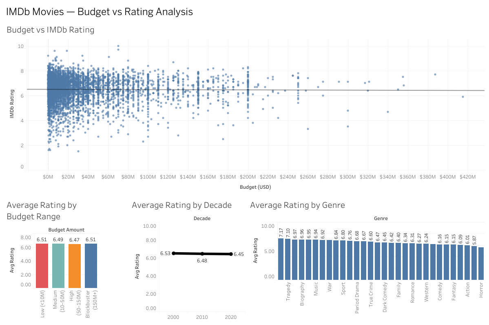

# IMDb Movie Budget vs Rating Analysis

Analysis of movie production budgets and their relationship with IMDb ratings using Python, PostgreSQL, SQL, and Tableau.

---

## Objective

Analyze whether higher movie production budgets are associated with higher IMDb ratings, and explore how ratings vary across:

- budget ranges
- genres
- decades

The project demonstrates a full analytics workflow from raw multi-file datasets to cleaned data, SQL analysis, and dashboard visualization.

---

## Data Source

IMDb movie dataset by Raed Addala (Kaggle):

IMDB Movies From 1920 to 2025  
The most popular ~600 movies per year with rich metadata.

Dataset link:  
https://www.kaggle.com/datasets/raedaddala/imdb-movies-from-1960-to-2023

Dataset description:

- ~60,000 movies
- Covers 100+ years
- Annual CSV files
- Includes:
  - ratings
  - budgets
  - s
  - metadata
  - awards
  - financial fields

## Python Data Preparation

Python (pandas) was used to merge and clean the yearly datasets.

Process:

- Collected yearly merged CSV files (2000–2025)
- Merged all yearly files into one dataset
- Selected relevant columns:
  - Title
  - Year
  - Rating
  - budget
  - s
  - awards_content
- Removed numeric prefixes from titles
- Filtered rows to budgets listed in USD only
- Cleaned budget field:
  - removed `$`
  - removed commas
  - removed `(estimated)`
- Converted budget to numeric
- Dropped invalid rows
- Exported cleaned dataset → `imdb_clean.csv`

Python scripts available in:

[`python/`](python/)


---

## Database Analysis (PostgreSQL)

The cleaned dataset was imported into PostgreSQL for structured analysis.

Steps:

- Created SQL table
- Imported cleaned CSV
- Converted column types to numeric
- Performed analytical queries and aggregations

SQL analysis included:

- Budget vs rating dataset extraction
- Budget amount grouping using CASE logic
- Average rating by decade
-  rating analysis using:
  - string_to_array
  - unnest
  - regexp_replace
- Budget–rating correlation calculation
- Top rated movies using window functions

Queries available in:

[`SQL_queries/`](SQL_queries/)


---

## Budget Tier Definition

Movies were grouped into budget categories:

- Low (< $10M)
- Medium ($10M–50M)
- High ($50M–150M)
- Blockbuster ($150M+)

Used to compare rating averages across production scale.

---
## Methodology Note — Genre Sample Size

To avoid unreliable averages from very small samples, genres with fewer than 50 movies in the dataset were excluded from the genre rating comparison. This ensures that reported genre averages are based on sufficiently large sample sizes.

## Key Findings

- Budget and IMDb rating show **near-zero correlation**
- Higher budgets do not reliably produce higher ratings
- Average ratings are very similar across all budget ranges
- Documentary and biography films have the highest average ratings
- Rating averages are stable across decades
- Overall, production budget is not a reliable predictor of IMDb rating in this dataset.

Correlation result (SQL):

```
Correlation ≈ -0.01

```
## Top 10 movies from this 2000-2025 dataset based on IMDb ratings

[`top10_movies_based_on_ratings_table.csv`](SQL_queries/top10_movies_based_on_ratings_table.csv)

Trend line regression in Tableau:

- Trend line slope ≈ 0, indicating no meaningful relationship.

---

## Tableau Dashboard

Interactive Tableau Public dashboard:

https://public.tableau.com/app/profile/vilimas.sipaila/viz/imdb_budget_vs_rating_dashboard/Dashboard1

## Dashboard Preview



Dashboard includes:

- Budget vs Rating scatter with trend line
- Average rating by budget range
- Average rating by decade
- Average rating by 
- Interactive filters

---

## Tableau Data Files

SQL query outputs used for visualization are stored in:

[`data_for_tableau/`](data_for_tableau/)

Files include:

- budget_vs_rating.csv
- budget_amounts.csv
- ratings_by_decade.csv
- _ratings.csv

---

## Repository Structure

```
python/
    merge and cleaning scripts

SQL_queries/
    PostgreSQL analysis queries

data/
    cleaned dataset

data_for_tableau/
    aggregated outputs for Tableau

README.md
```

---
## Reproducibility

The project can be reproduced by:

1. Merging yearly CSV files using python/merge.py
2. Cleaning with python/clean_data.py
3. Importing data/imdb_clean.csv into PostgreSQL
4. Running queries from SQL_queries/
5. Loading sql outputs into Tableau
